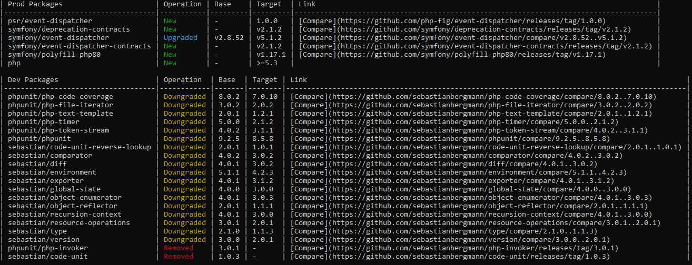

# Composer Diff Plugin

[](https://packagist.org/packages/ion-bazan/composer-diff)
[](https://packagist.org/packages/ion-bazan/composer-diff)
[](https://packagist.org/packages/ion-bazan/composer-diff)
[](https://packagist.org/packages/ion-bazan/composer-diff)
[](https://github.com/IonBazan/composer-diff/actions)
[](https://codecov.io/gh/IonBazan/composer-diff)
[](https://dashboard.stryker-mutator.io/reports/github.com/IonBazan/composer-diff/master)
[](https://packagist.org/packages/ion-bazan/composer-diff)
[](https://packagist.org/packages/ion-bazan/composer-diff)

Generates packages changes report in Markdown format by comparing `composer.lock` files. Compares with last-commited changes by default.

## Now available as [GitHub Action](https://github.com/marketplace/actions/composer-diff)!



# Installation

```shell script
composer global require ion-bazan/composer-diff
```

# Usage

```shell script
composer diff # Displays packages changed in current git tree compared with HEAD
composer diff --help # Display detailed usage instructions
```

## Example output

| Prod Packages                      | Operation | Base    | Target  |
|------------------------------------|-----------|---------|---------|
| psr/event-dispatcher               | New       | -       | 1.0.0   |
| symfony/deprecation-contracts      | New       | -       | v2.1.2  |
| symfony/event-dispatcher           | Upgraded  | v2.8.52 | v5.1.2  |
| symfony/event-dispatcher-contracts | New       | -       | v2.1.2  |
| symfony/polyfill-php80             | New       | -       | v1.17.1 |
| php                                | New       | -       | >=5.3   |

| Dev Packages                       | Operation  | Base  | Target |
|------------------------------------|------------|-------|--------|
| phpunit/php-code-coverage          | Downgraded | 8.0.2 | 7.0.10 |
| phpunit/php-file-iterator          | Downgraded | 3.0.2 | 2.0.2  |
| phpunit/php-text-template          | Downgraded | 2.0.1 | 1.2.1  |
| phpunit/php-timer                  | Downgraded | 5.0.0 | 2.1.2  |
| phpunit/php-token-stream           | Downgraded | 4.0.2 | 3.1.1  |
| phpunit/phpunit                    | Downgraded | 9.2.5 | 8.5.8  |
| sebastian/code-unit-reverse-lookup | Downgraded | 2.0.1 | 1.0.1  |
| sebastian/comparator               | Downgraded | 4.0.2 | 3.0.2  |
| sebastian/diff                     | Downgraded | 4.0.1 | 3.0.2  |
| sebastian/environment              | Downgraded | 5.1.1 | 4.2.3  |
| sebastian/exporter                 | Downgraded | 4.0.1 | 3.1.2  |
| sebastian/global-state             | Downgraded | 4.0.0 | 3.0.0  |
| sebastian/object-enumerator        | Downgraded | 4.0.1 | 3.0.3  |
| sebastian/object-reflector         | Downgraded | 2.0.1 | 1.1.1  |
| sebastian/recursion-context        | Downgraded | 4.0.1 | 3.0.0  |
| sebastian/resource-operations      | Downgraded | 3.0.1 | 2.0.1  |
| sebastian/type                     | Downgraded | 2.1.0 | 1.1.3  |
| sebastian/version                  | Downgraded | 3.0.0 | 2.0.1  |
| phpunit/php-invoker                | Removed    | 3.0.1 | -      |
| sebastian/code-unit                | Removed    | 1.0.3 | -      |

## Options

 - `--base` (`-b`) - path, URL or git ref to original `composer.lock` file
 - `--target` (`-t`) - path, URL or git ref to modified `composer.lock` file
 - `--no-dev` - ignore dev dependencies (`require-dev`)
 - `--no-prod` - ignore prod dependencies (`require`)
 - `--with-platform` (`-p`) - include platform dependencies (PHP, extensions, etc.)
 - `--with-links` (`-l`) - include compare/release URLs
 - `--format` (`-f`) - output format (mdtable, mdlist, json) - default: `mdtable`
 - `--gitlab-domains` - custom gitlab domains for compare/release URLs - default: use composer config
 
## Advanced usage

```shell script
composer diff master # Compare current composer.lock with the one on master branch
composer diff master:composer.lock develop:composer.lock -p # Compare master and develop branches, including platform dependencies
composer diff --no-dev # ignore dev dependencies
composer diff -p # include platform dependencies
composer diff -f json # Output as JSON instead of table
```

### Strict mode

To help you control your dependencies, you may pass `--strict` option when running in CI. If there are any changes detected, a non-zero exit code will be returned.

Exit code of the command is built using following bit flags:

*  `0` - OK.
*  `1` - General error.
*  `2` - There were changes in prod packages.
*  `4` - There were changes is dev packages.
*  `8` - There were downgrades in prod packages.
* `16` - There were downgrades in dev packages.

You may check for individual flags or simply check if the status is greater or equal 8 if you don't want to downgrade any package.

# Similar packages

While there are several existing packages offering similar functionality:

 - [jbzoo/composer-diff](https://packagist.org/packages/jbzoo/composer-diff) - requires PHP 7.2+, no composer plugin support
 - [josefglatz/composer-diff-plugin](https://packagist.org/packages/josefglatz/composer-diff-plugin) - works only right after install/update
 - [davidrjonas/composer-lock-diff](https://packagist.org/packages/davidrjonas/composer-lock-diff) - does not work as composer plugin

This package offers:

 - Support for wide range of PHP versions, starting from 5.3.2 up to 8.0 and newer.
 - No dependencies if you run it as composer plugin.
 - Both standalone executable and composer plugin interface - you choose how you want to use it.
 - Allows generating reports in several formats.
 - Extra Gitlab domains support.
 - [GitHub Action](https://github.com/marketplace/actions/composer-diff) with example workflow
 - 100% test coverage.
 - MIT license.

